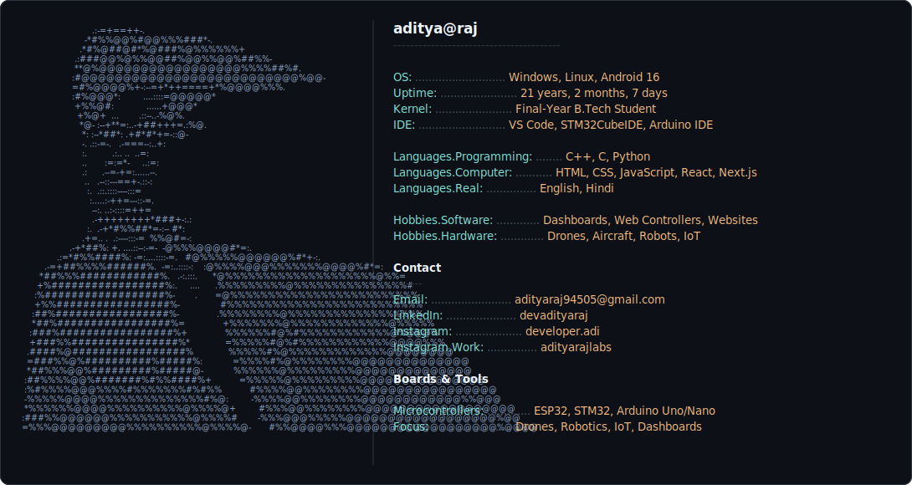

### Hey, I'm Aditya 👋

Final-year engineering student building things that fly, sense, and connect — Arduino, ESP32, STM32, drones, robotics, and the web dashboards that talk to them.

<picture>
  <source media="(prefers-color-scheme: dark)" srcset="dark_mode.svg">
  <source media="(prefers-color-scheme: light)" srcset="light_mode.svg">
  
</picture>
